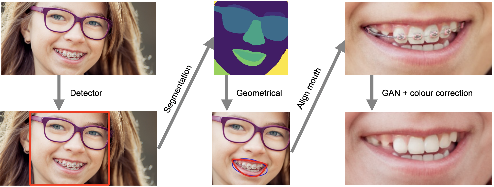

# Facial attribute editing using neural networks
**Thesis text:** [Google Docs](https://drive.google.com/file/d/1tOLZpqmf8B0T9z4zwQBKu6sjFAXwE_NM/view?usp=sharing), [GitHub](./thesis.pdf) 
**Presentation:** [Google Docs](https://drive.google.com/file/d/1MAmnQDKBt09gWVpgIfi78bxShgP72lnY/view?usp=sharing), [GitHub](./presentation.pdf)

## Principal scheme of the image editing pipeline

#### Color correction pipeline

## Attention GAN results

## Examples
### Braces removal

### Braces generation

